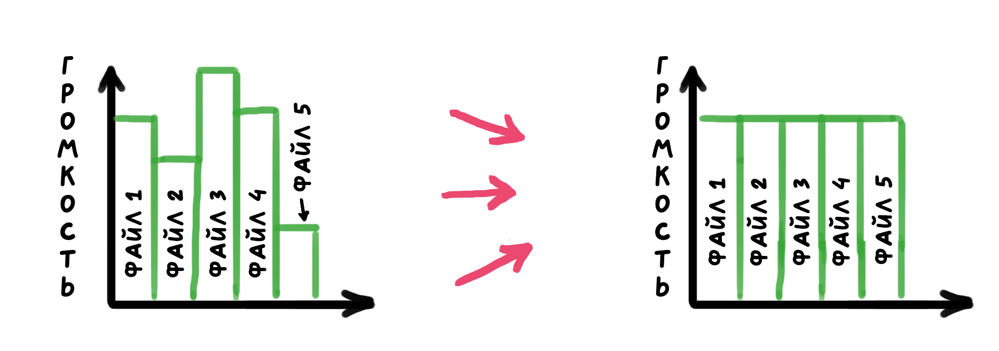
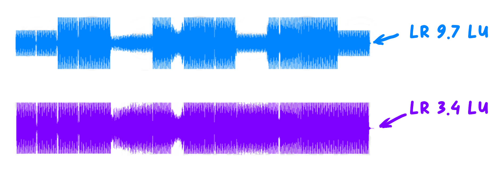
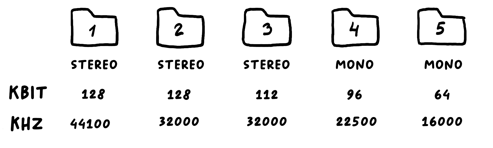
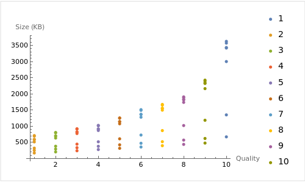

## Сбор

Ищу музыку и звуки и кладу все в одну папку.

**Самые классные сервисы:**
- [Chostic](https://www.chosic.com/free-music/all/)- c этого начинаю поиски.
- [японские стоки](https://www.nash.jp/nml/) - платно, но никто почти не юзает.
- [Soniss](https://sonniss.com/)- часто раздает очень классные паки со звуками до 160 гигов.
- [Boom Library](https://www.boomlibrary.com/)- лучшее из того что есть по качеству.
- [CCmixter](https://dig.ccmixter.org/)- очень внимательно смотреть на копирайт.

**Средние:**
- [freesound](freesound.org) - не всегда ясны вопросы с копирайтом и много мусора
- [blipsound](https://blipsounds.com/community-library/ )- 35 Гб звуков от сообщества
- [Kenney](https://www.kenney.nl/assets/category:Audio?sort=update) - неплохо, но мало. Часто раздает все бесплатно.
- [Blue-Zone](https://www.bluezone-corporation.com/)- хорошее качество, но больше для серьезных проектов.
- [zapsplat](https://www.zapsplat.com/) - мало, но не затаскано.

**Приступ отчаяния:**
- [Adobe Free SFX Library](https://www.adobe.com/products/audition/offers/AdobeAuditionDLCSFX.html) 10 гигов и все так себе.
- [99sounds](https://99sounds.org/)- сайт делал человек под героином.


## Причесываем файлы

Какая проблема возникает с сотней скачанных файлов из разных источников? Они все имеют разные настройки и поэтому если включить их рядом  мозг будет сам пытаться нормализовать эти звуки и произойдет "ear fatigue" - звуковая усталость от игры. Поэтому для удобства привожу звуки к одному виду, тогда музыка будет перетекать плавно из трека в трек, а смешивать эффекты становится удобнее.


##### Начинаю с нормализации всех файлов.  

Нормализации существует два типа : 
- пиковая (просто поднимаем громкость всей дорожки пока не достигнет заданного нами значения) 
- RMS/LUFS/LKFS/dBFS (полная противоположность пиковой нормализации, проводится исходя из средней квадратичной громкости звукового участка)

Я использую второй вариант, он не так визуально явно работает как первый, но сильно приятней в конечном итоге. Отличие между аббревиатурами только в том какие циферки будете брать и что используется в вашей программе.

Привожу все данные, которыми пользуюсь:

- RMS финального микса голливудских саундтреков обычно не превышает -20 дБ, а некоторые даже не доходят до -24 дБ.（Современный мейнстрим находится на уровне -24 дБ LKFS).
- Выход встроенного динамика стандартных мобильных телефонов обрежет все, когда RMS звука превысит -8 дБ.
-  -23 LUFS было у Ryse: Son of Rome для Xbox One
- Bioshock Infinite: -11.8 LKFS
- Portal 2: -14.9 LKFS
- Tomb Raider: -16.7 LKFS
- The Walking Dead: -16.8 LKFS
- Arkham City: -17.1 LKFS
- Borderlands 2: -19.6 LKFS
- GTA IV: -20.6 LKFS
- Dishonored: -23.1 LKFS
- Skyrim: -26.0 LKFS

Что я использую:
- Музыка：-16 dB
- Ambience：-16 dB
- Диалоги: -12 dB
- SFX: -16 dB
- UI: -16 dB

Обычно зависит от проекта к проекту, например для веба легче всего выставить -16 dB всему т.к. музыка и звуки там отходят на второй план.

##### Диапазон громкости (Loudness Range)

Чем больше разница между громкостью на отдельных участках трека тем выше **Loudness Range**. 

Стандарты которые есть в играх:
- GTA IV: 18.3 LU
- The Walking Dead: 17.8 LU
- Skyrim: 17.3 LU
- Borderlands 2: 16.4 LU
- Tomb Raider: 14.9 LU
- Portal 2: 13.9 LU
- Bioshock Infinite: 13.2 LU
- Dishonored: 12.6 LU
- Arkham City: 10.6 LU

Стандарты от Wwise в зависимости от того где будут играть:

- Домашний кинотеатр: 20
- Гостинная: 18
- Кухня: 15
- Гостинная ночью:9
- В транспорте на мобиле: 6

Общее правило - чем громче будет среда где будут играть, тем можно делать ниже LR. 

Больше всего значение LR зависит от жанра игры и где в нее будут играть. 

Игра с низким уровнем LR и звуком -23LKFS может быть более утомительней, чем игра с более высоким уровнем громкости и большим LR. Если игра очень громкая, пользователь, скорее всего, уменьшит громкость и, наоборот, увеличит ее, если игра очень тихая. Если звук имеет небольшой динамический диапазон, он будет звучать чрезмерно сжатым.


## Сортировка

Сортируем скачанное по пяти папкам которые называем Tier_1,Tier_2,Tier_3,Tier_4,Tier_5.
В эти папки кладет в зависимости от того насколько качественный он должен быть на выходе. В папку 1,я кладу музыку, а в последнюю папку кладу самый ненужный звук в игре.


Теперь создаю батник, который в один клик преобразует файлы и запишет их всех в папку Finals:

``` powershell
@echo off

setlocal enabledelayedexpansion

REM Пути к папкам
set TIER_1=Tier_1
set TIER_2=Tier_2
set TIER_3=Tier_3
set TIER_4=Tier_4
set TIER_5=Tier_5
set FINAL=Final


for %%f in (%TIER_1%\*.*) do (
    ffmpeg -i "%%f" -c:a libvorbis -q:a 10 -ar 44100 "%FINAL%\%%~nf.ogg")

for %%f in (%TIER_2%\*.*) do (
    ffmpeg -i "%%f" -c:a libvorbis -q:a 7 -ar 32100 "%FINAL%\%%~nf.ogg")


for %%f in (%TIER_3%\*.*) do (
    ffmpeg -i "%%f" -c:a libvorbis -q:a 5 -ar 32100 "%FINAL%\%%~nf.ogg")


for %%f in (%TIER_4%\*.*) do (
    ffmpeg -i "%%f" -c:a libvorbis -q:a 5 -ar 22050 "%FINAL%\%%~nf.ogg")


for %%f in (%TIER_5%\*.*) do (
    ffmpeg -i "%%f" -ac 1 -c:a libvorbis -q:a 3 -ar 16000 "%FINAL%\%%~nf.ogg")

echo done.
pause

```

Сохраняем как convert_to_ogg_web.bat, если нужно будет сохранить для мобил или ПК я просто создаю новый батник с другими параметрами. 

В итоге у меня есть пять папок с оригинальными нормализованными звуковыми файлами большого размера и любого разрешения и папка Finals, где будут файлы оптимизированные для веба или мобил или любой другой платформы.

Тоже самое, но на питоне, при этом с нормализацией описанное выше и выводом доп. информации:

```python
import subprocess
import glob
import os

# Константы параметров громкости
LOUDNESS_TARGET = -16  # Integrated Loudness (I)
TRUE_PEAK = -1         # True Peak (TP)
LOUDNESS_RANGE = 16    # Loudness Range (LRA)

# Определение папок
folders = {
    'Tier_1': {'q': 10, 'ar': 44100},
    'Tier_2': {'q': 7, 'ar': 32100},
    'Tier_3': {'q': 5, 'ar': 32100},
    'Tier_4': {'q': 5, 'ar': 22050},
    'Tier_5': {'ac': 1, 'q': 3, 'ar': 16000},
}
final_folder = 'Final'

# Создание папки Final, если она не существует
if not os.path.exists(final_folder):
    os.makedirs(final_folder)

# Функция для получения размера файла
def get_file_size(path):
    return os.path.getsize(path)

# Функция для расчета процентного изменения размера
def calculate_percentage_change(original, new):
    change = ((new - original) / original) * 100
    return round(change, 2)

# Суммарные размеры файлов до и после конвертации
total_original_size = 0
total_converted_size = 0

# Обработка файлов в каждой папке
for folder, params in folders.items():
    for file_path in glob.glob(f'{folder}/*.*'):
        original_size = get_file_size(file_path)
        total_original_size += original_size
        file_name = os.path.splitext(os.path.basename(file_path))[0]
        output_path = f'{final_folder}/{file_name}.ogg'

        command = [
            'ffmpeg', '-loglevel', 'error', '-i', file_path, 
            '-c:a', 'libvorbis', '-filter:a', 
            f'loudnorm=I={LOUDNESS_TARGET}:TP={TRUE_PEAK}:LRA={LOUDNESS_RANGE}'
        ]
        if 'ac' in params:
            command += ['-ac', str(params['ac'])]
        command += ['-q:a', str(params['q']), '-ar', str(params['ar']), output_path]

        subprocess.run(command)

        # Получение и сравнение размера конвертированного файла
        converted_size = get_file_size(output_path)
        total_converted_size += converted_size
        percentage_change = calculate_percentage_change(original_size, converted_size)

        print(f'{file_name}: Размер файла изменен на {percentage_change}%')

# Расчет и вывод общих результатов
total_original_size_mb = total_original_size / (1024 * 1024)
total_converted_size_mb = total_converted_size / (1024 * 1024)
total_size_reduction = total_original_size_mb - total_converted_size_mb

print(f'\nОбщий результат:')
print(f'Общий размер до конвертации: {total_original_size_mb:.2f} МБ')
print(f'Общий размер после конвертации: {total_converted_size_mb:.2f} МБ')
print(f'Общее уменьшение размера: {total_size_reduction:.2f} МБ')

print('done.')


```


## Что мне вообще подходит?

Каждый случай обычно индивидуален, поэтому в некоторых случаях музыкальные треки я пережимаю вручную. Для этого я написал специальных батник, который создает 200 вариантов трека со всеми возможными комбинациями битрейта/частоты и количества каналов. Потом среди них я ищу вариант оптимальный в плане жертвы качеством в угоду весу.

Батник берет все файлы из папки Music_test и записывает все варианты в папку Final

``` powershell
@echo off
setlocal enabledelayedexpansion

set SOURCE_FOLDER=Music_test
set OUTPUT_FOLDER=Final
set ERROR_LOG=error_log.txt

if not exist "%OUTPUT_FOLDER%" mkdir "%OUTPUT_FOLDER%"

set QUALITIES=1 2 3 4 5 6 7 8 9 10
set SAMPLE_RATES=8000 11025 16000 22050 32000 44100 48000 88200 96000
set CHANNELS=1 2

for %%f in ("%SOURCE_FOLDER%\*.*") do (
    for %%q in (%QUALITIES%) do (
        for %%s in (%SAMPLE_RATES%) do (
            for %%c in (%CHANNELS%) do (
                echo converting %%~nxf with bitrate %%q, sample rate %%s and %%c channels
                ffmpeg -i "%%f" -ac %%c -c:a libvorbis -q:a %%q -ar %%s "%OUTPUT_FOLDER%\%%~nf_q%%q_s%%s_c%%cch.ogg" 
            )
        )
    )
)

echo done
pause

```

#### Таблица на которую я ориентируюсь если важен размер. 

Минутный казуальный трек по моему личному опыту дает примерно такой график корреляций.



Если я хочу получить файл в 1МБ я могу использовать качество битрейта 1 (64 kbit/s) и любую частоту или качество битрейта 10 (500 kbit/s) и частоту только 11025 Hz. Для казуального веба я обычно использую промежуток между 4-6 и частоту от 22050 Hz.

Если брать коэффициент корреляции Пирсона, то на тех файлах что я тестил выходит:
- Частота - размер:0.47
- Моно/Стерео - размер:  0.34
- Битрейт - размер: 0.55

Это значит что битрейт и частота влияют сильнее всего на конечный размер файла, но лучше всего все равно отбирать отслушав все вручную.


## Источники

https://blog.audiokinetic.com/en/loudness-processing-best-practices-series-chapter1-loudness-measurement-part1/ 
https://blog.audiokinetic.com/en/loudness-processing-best-practices-chapter-2-loudness-dynamics-and-how-to-process-them/
https://blog.audiokinetic.com/en/loudness-processing-best-practice-chapter-3-scalable-loudness-processing-for-games/
https://designingsound.org/2013/02/20/different-loudness-ranges-for-console-and-mobile-games/
https://mcvuk.com/development-news/audio-loudness-for-gaming-the-battle-against-ear-fatigue/
https://www.stephenschappler.com/2013/07/26/listening-for-loudness-in-video-games/


